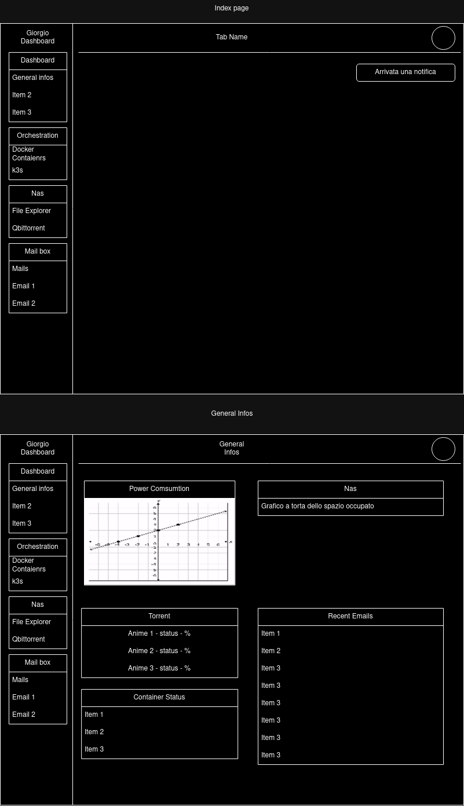

# Website

Website wrote in go and htmx to do several things:

1. Administration of the server
2. Docker container managment
3. RCON access (For all game-server that support)
# Design

# TODO

- Backend stuff
  - [ ] Dockerfile and compose
  - [ ] HTTPS (maybe??)
  - [ ] Mongodb connection
  - [ ] JWT Auth
  - [ ] Login,Registration and logout endpoints
  - [ ] Docker connection and orchestration
  - [ ] RCON connection

- Frontend stuff
  - [ ] Login and Registration page
  - [ ] Index page
  - [ ] General info page
  - [ ] Orchestration page
  - [ ] Nas Page
  - [ ] Mail Box page
